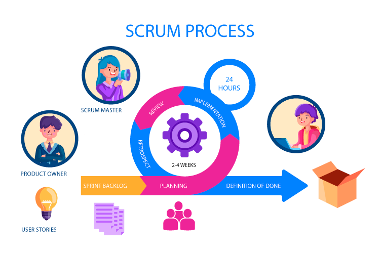

# Project Week

### Project Week, and more importantly your portfolio, is one major thing that can make or break your job hunt as a developer!

-   #### Employers review your portfolio when deciding on proposing interviews!

-   #### You also need to be prepared to present/give details on your project as part of your interview as well!

---

# Project Expectations

-   Complete an MVP by next Thursday (Finishing up Friday morning can happen, but try to be ready by end of day Thursday!)

-   Give a presentation of your MVP to the class. (Graduation presentations are optional, but encouraged!)

-   Hold yourself and your team accountable (SCRUM Leader)

---

# Project Requirements

-   Your project should include **at least** one feature learned outside of the course. (New Packages, Authentication, Sockets, CSS Frameworks, Database types...)

-   Project should be pushed/viewable on Github, and you should get into the habit of updating your project regularly with pushes to github!

---

# AGILE vs Waterfall

Before Agile there was the Waterfall method. A far more static approach to project management that sets an objective and focuses on a direct line to it's completion with less iteration.

-   Waterfall is useful for small projects/features that can be finished quickly. Needing less adaptation or flexibility. The planning is more rigid and harder to change using the Waterfall method.

---

# AGILE Development

Agile is a methodology (Not a strict ruleset!) that opens up project management to a style that emphasizes flexibility and adaptability.
Great for when a deliverable is a 'moving target'. Ideal for software development because of the fast changes and frequent updates that come with managing a code base.

### Agile Steps(Repeated):

**1. Planning :** Defining Scope for the project, building a roadmap, and identifying stakeholders.
**2. Designing:** Create high-level design structure related to the packages, components, and any details.
**3. Developing:** Coding, testing, and integrating the components/structure. 4. Testing: Testing the systems for functionality, performance, security
**5. Deploying:** Pushing a feature to "production", acquire feedback, and support the feature.

#### Typically broken down into sprints. (Daily, Weekly)

---

# How is AGILE applied?

## Scrum

-   Scrum is the application of Agile into small sprints.
-   A Product Owner communicates needs to a Scrum Master and then the Scrum Master guides/manages their Development Team for the project.
-   Establish goals based on User Stories with realistic deadlines.

### Given the Scale of your projects, you should plan goals like so:

> #### 1. Plan out User Stories that describe your application's functionality from a User's perspective.
>
> > Examples:
> > As a **User** I should be able to **sign into** the application.
> > As a **Signed in User** I should be able to **Add Items to a Shopping Cart**.
>
> #### 2. WireFrame/Concept Planning (Try to keep this to 1 Day) - Based on the user stories, plan out the different pages of your application.

---

# Resources

### Wireframe Making Websites:

https://whimsical.com/
https://draw.io/
https://app.moqups.com/
https://wireframe.cc/
https://balsamiq.com/wireframes/ (Free for 30 days)
https://www.figma.com/ (Can be difficult to use quickly, but it is very customizable.)

### Wireframe UI examples:

https://tailwindui.com/

### Icons & Images:

https://www.flaticon.com/
https://thenounproject.com/

---
